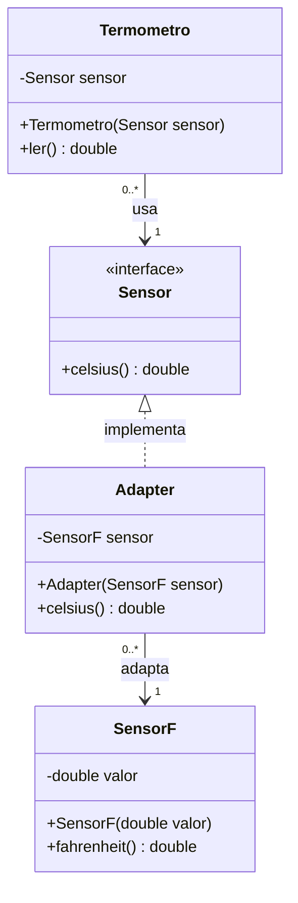

```mermaid
classDiagram
    class Sensor {
        <<interface>>
        +celsius() double
    }

    class SensorF {
        -double valor
        +SensorF(double valor)
        +fahrenheit() double
    }

    class Adapter {
        -SensorF sensor
        +Adapter(SensorF sensor)
        +celsius() double
    }

    class Termometro {
        -Sensor sensor
        +Termometro(Sensor sensor)
        +ler() double
    }

    Sensor <|.. Adapter : implementa
    Adapter "0..*" --> "1" SensorF : adapta
    Termometro "0..*" --> "1" Sensor : usa
```
